# VaultFill Onboarding State Machine

> **Document Type:** Architecture Blueprint  
> **Last Updated:** 2026-02-09  
> **Owner:** Metis (Systems Architect)  
> **Status:** v1.0 — Ready for Implementation

---

## 1. State Machine Diagram (Mermaid)

```mermaid
stateDiagram-v2
    [*] --> IDLE

    IDLE --> GREETING : user_opens_chat
    
    GREETING --> PROBLEM_ID : user_responds
    GREETING --> GREETING : irrelevant_input [retry ≤ 2]
    GREETING --> EXIT_GRACEFUL : no_response_timeout(60s)

    PROBLEM_ID --> PROBLEM_ID_DEEP : pain_identified
    PROBLEM_ID --> PROBLEM_ID : vague_input [clarify ≤ 2]
    PROBLEM_ID --> EXIT_GRACEFUL : user_exits
    PROBLEM_ID --> GREETING : hard_reset

    PROBLEM_ID_DEEP --> DEMO : user_confirms_pain
    PROBLEM_ID_DEEP --> PROBLEM_ID : pivot_topic
    PROBLEM_ID_DEEP --> EXIT_GRACEFUL : user_exits

    DEMO --> DEMO_QUESTIONNAIRE : starts_live_demo
    DEMO --> DEMO_CITATION : views_citation_demo
    DEMO --> LEAD_CAPTURE : demo_complete
    DEMO --> EXIT_GRACEFUL : user_exits

    DEMO_QUESTIONNAIRE --> DEMO_CITATION : step_complete
    DEMO_CITATION --> LEAD_CAPTURE : step_complete

    LEAD_CAPTURE --> LEAD_CAPTURE_EMAIL : provides_email
    LEAD_CAPTURE --> LEAD_CAPTURE_SOFT : declines_email
    LEAD_CAPTURE --> EXIT_GRACEFUL : user_exits

    LEAD_CAPTURE_EMAIL --> COMPLETE : email_captured
    LEAD_CAPTURE_SOFT --> COMPLETE : soft_cta_accepted

    COMPLETE --> [*]
    EXIT_GRACEFUL --> [*]
```

---

## 2. State Definitions

### 2.1 IDLE
| Property | Value |
|----------|-------|
| **Description** | Chat widget loaded, no interaction yet |
| **Entry Condition** | Page load / widget mount |
| **Bot Behavior** | None (passive). Optional: proactive bubble after 15s idle on pricing page |
| **Data Captured** | `page_url`, `referrer`, `utm_params`, `timestamp` |

### 2.2 GREETING
| Property | Value |
|----------|-------|
| **Description** | First conversational exchange — establish rapport and frame the problem space |
| **Entry Condition** | User clicks chat or sends first message |
| **Bot Message** | *"Hey — quick question. How are you currently handling security questionnaires? (a) Manually in spreadsheets, (b) Using another tool, (c) Just exploring"* |
| **Design Intent** | Single low-friction question. No name ask. No form. Feels like a conversation, not a funnel. |
| **Timeout** | 60s → transition to EXIT_GRACEFUL with soft follow-up |
| **Max Retries** | 2 irrelevant inputs before graceful pivot |

### 2.3 PROBLEM_ID (Problem Identification)
| Property | Value |
|----------|-------|
| **Description** | Diagnose the user's specific pain point to personalize the demo |
| **Entry Condition** | User responds to greeting |
| **Bot Logic** | Branch based on greeting response: |

| Greeting Answer | Follow-up | Pain Target |
|-----------------|-----------|-------------|
| (a) Manual/spreadsheets | *"How many questionnaires per month? Ballpark."* | Time waste, error risk |
| (b) Using another tool | *"What's the biggest frustration with your current tool?"* | Integration fatigue, accuracy |
| (c) Just exploring | *"No worries. Most teams find us when questionnaires start eating 20+ hrs/week. Sound familiar?"* | Latent pain activation |

**Classifier tags** (set on user response):
- `pain:time_waste` — mentions hours, manual, slow, tedious
- `pain:accuracy` — mentions errors, wrong answers, outdated
- `pain:scale` — mentions growing, more clients, enterprise customers
- `pain:cost` — mentions expensive, consultant, budget
- `pain:none` — no identifiable pain → soft demo offer

### 2.4 PROBLEM_ID_DEEP (Pain Amplification)
| Property | Value |
|----------|-------|
| **Description** | Mirror the pain back, amplify with data, then bridge to demo |
| **Entry Condition** | Pain classifier tag assigned |
| **Bot Logic by Tag** | |

| Tag | Amplification Message |
|-----|----------------------|
| `pain:time_waste` | *"Yeah — the average security team spends 40+ hrs/month on questionnaires. We cut that to under 4. Want to see how?"* |
| `pain:accuracy` | *"Outdated answers are a deal-killer. VaultFill pulls from your live security vault — every answer is cited and current. Want a quick look?"* |
| `pain:scale` | *"Scaling questionnaire responses without scaling headcount is exactly what we built for. Quick 60-second demo?"* |
| `pain:cost` | *"Most teams spend $15K+/yr on consultants for this. VaultFill replaces that. Want to see the workflow?"* |
| `pain:none` | *"Here's a 60-second look at how it works — no commitment."* |

**Transition trigger:** Any affirmative response → DEMO. Negative → EXIT_GRACEFUL with resource drop.

### 2.5 DEMO (Interactive Demonstration)
| Property | Value |
|----------|-------|
| **Description** | Show, don't tell. Two-part micro-demo inline in chat. |
| **Entry Condition** | User accepts demo offer |
| **Substates** | DEMO_QUESTIONNAIRE → DEMO_CITATION |

#### DEMO_QUESTIONNAIRE
- Bot displays a **sample security question** (e.g., *"Do you encrypt data at rest and in transit?"*)
- Shows VaultFill auto-generating the answer in real-time (typing animation)
- Generated answer includes **confidence score** (e.g., 97%) and **source citation**
- **No login required.** This is anonymous.

#### DEMO_CITATION
- Bot highlights the **citation trail**: *"This answer was sourced from your SOC 2 Type II report, Section 4.2"*
- Emphasizes: *"Every answer is traceable. Your auditor sees exactly where it came from."*
- Differentiator callout: *"Unlike [competitor], we don't guess — we cite."*

**Demo complete trigger:** Both substates shown → auto-transition to LEAD_CAPTURE with 2s pause.

### 2.6 LEAD_CAPTURE
| Property | Value |
|----------|-------|
| **Description** | Convert interest to contact. Two paths: hard (email) and soft (resource). |
| **Entry Condition** | Demo complete |
| **Bot Message** | *"That's VaultFill in action. Want me to set up a pilot with your actual documents? Drop your work email and I'll have the team reach out today."* |

#### LEAD_CAPTURE_EMAIL (Hard Capture)
- User provides email → validate format → store in leads DB
- Bot: *"Perfect. You'll hear from us within 2 hours. In the meantime, here's our security whitepaper."*
- **Data stored:** `email`, `pain_tag`, `demo_completed`, `source_page`, `utm_params`, `timestamp`

#### LEAD_CAPTURE_SOFT (Soft Capture)
- User declines email → no pressure
- Bot: *"Totally fine. Here's a link to try it yourself — no signup needed: [sandbox link]. If you want to chat later, I'm always here."*
- **Data stored:** `anonymous_session_id`, `pain_tag`, `demo_completed`, `soft_cta_clicked`

### 2.7 COMPLETE
| Property | Value |
|----------|-------|
| **Description** | Terminal success state |
| **Action** | Fire analytics event `onboarding_complete`. Tag lead in CRM pipeline. |

### 2.8 EXIT_GRACEFUL
| Property | Value |
|----------|-------|
| **Description** | User disengaged at any point |
| **Bot Message** | *"No worries at all. If questionnaires ever become a headache, we're here. 🛡️"* |
| **Action** | Fire `onboarding_exit` event with `last_state` and `pain_tag` (if set). No email follow-up for anonymous users. |

---

## 3. Transition Logic Table

| From | To | Trigger | Guard Condition | Side Effect |
|------|----|---------|-----------------|-------------|
| IDLE | GREETING | `user_opens_chat` | — | Log session start |
| GREETING | PROBLEM_ID | `user_responds` | Response is conversational | Classify intent |
| GREETING | GREETING | `irrelevant_input` | `retry_count < 2` | Increment retry, rephrase question |
| GREETING | EXIT_GRACEFUL | `timeout(60s)` | — | Log timeout |
| PROBLEM_ID | PROBLEM_ID_DEEP | `pain_identified` | Classifier confidence > 0.6 | Set `pain_tag` |
| PROBLEM_ID | PROBLEM_ID | `vague_input` | `clarify_count < 2` | Ask follow-up |
| PROBLEM_ID | EXIT_GRACEFUL | `user_exits` | — | — |
| PROBLEM_ID_DEEP | DEMO | `user_confirms_pain` | Affirmative response | — |
| PROBLEM_ID_DEEP | EXIT_GRACEFUL | `user_declines` | — | Drop resource link |
| DEMO | DEMO_QUESTIONNAIRE | `auto` | — | Load sample question |
| DEMO_QUESTIONNAIRE | DEMO_CITATION | `step_complete` | Answer rendered | — |
| DEMO_CITATION | LEAD_CAPTURE | `step_complete` | Citation shown | 2s delay |
| LEAD_CAPTURE | LEAD_CAPTURE_EMAIL | `provides_email` | Valid email format | Store lead |
| LEAD_CAPTURE | LEAD_CAPTURE_SOFT | `declines_email` | — | Offer sandbox link |
| LEAD_CAPTURE_EMAIL | COMPLETE | `email_captured` | — | CRM pipeline, analytics |
| LEAD_CAPTURE_SOFT | COMPLETE | `soft_cta_accepted` | — | Analytics only |
| ANY | EXIT_GRACEFUL | `user_closes_widget` | — | Log with `last_state` |

---

## 4. Edge Cases & Error Handling

### 4.1 Irrelevant / Off-Topic Input
- **Any state:** If NLP classifier returns `intent:off_topic` with high confidence, respond: *"I'm best at helping with security questionnaires — want to see how VaultFill handles them?"*
- Redirect to nearest logical state. Max 2 redirects before EXIT_GRACEFUL.

### 4.2 Profanity / Abuse
- Detect via content filter → respond: *"I'm here to help with security questionnaires whenever you're ready."*
- Log event. Do not escalate or engage.

### 4.3 Returning User
- Check `anonymous_session_id` cookie (30-day TTL)
- If previous session reached DEMO or beyond: skip GREETING and PROBLEM_ID, offer: *"Welcome back! Want to pick up where we left off, or start fresh?"*
- Restore `pain_tag` from previous session.

### 4.4 Multiple Tabs / Duplicate Sessions
- Deduplicate by session ID. Latest tab wins. Previous tab shows: *"Continuing in your other tab."*

### 4.5 Network Interruption
- Client-side: queue messages, retry with exponential backoff (1s, 2s, 4s, max 30s)
- On reconnect: restore state from server. Bot: *"Looks like we got disconnected. Here's where we were..."*

---

## 5. Analytics Events

| Event | Fired At | Payload |
|-------|----------|---------|
| `onboarding_start` | IDLE → GREETING | `session_id`, `page`, `utm` |
| `pain_identified` | PROBLEM_ID → PROBLEM_ID_DEEP | `pain_tag`, `raw_input` |
| `demo_started` | → DEMO | `pain_tag` |
| `demo_step_complete` | Each demo substate | `step_name`, `duration_ms` |
| `lead_captured` | LEAD_CAPTURE_EMAIL → COMPLETE | `email`, `pain_tag`, `demo_duration` |
| `soft_cta_accepted` | LEAD_CAPTURE_SOFT → COMPLETE | `pain_tag` |
| `onboarding_exit` | → EXIT_GRACEFUL | `last_state`, `pain_tag`, `session_duration` |
| `onboarding_complete` | → COMPLETE | Full session summary |

---

## 6. Implementation Notes

### State Storage
- **Client:** State held in React context (`useReducer` pattern). Persisted to `sessionStorage` for tab recovery.
- **Server:** State mirrored in Redis with 24hr TTL keyed by `session_id`. Required for returning user logic.

### Privacy Alignment
- **No PII captured until LEAD_CAPTURE_EMAIL.** All prior states operate on anonymous `session_id` only.
- `pain_tag` and interaction data are non-identifying metadata.
- Email storage follows standard encryption-at-rest. No third-party sharing without consent.
- Cookie for returning user detection is first-party, functional (not tracking). Exempt from consent banner under GDPR Art. 6(1)(f).

### Tech Stack Integration
- State machine implementation: **XState v5** (recommended) or custom `useReducer` + context
- NLP classification: API route calling OpenAI with few-shot prompt for pain classification
- Demo rendering: Pre-built React components, no live API calls during demo (latency control)

---

## 7. Conversion Funnel Targets

| Stage | Target Rate | Measurement |
|-------|-------------|-------------|
| IDLE → GREETING | 8-12% of page visitors | Chat open rate |
| GREETING → PROBLEM_ID | 70%+ | Response rate |
| PROBLEM_ID → DEMO | 50%+ | Demo acceptance |
| DEMO → LEAD_CAPTURE | 85%+ (auto-transition) | Completion rate |
| LEAD_CAPTURE → EMAIL | 25-35% | Hard conversion |
| LEAD_CAPTURE → SOFT CTA | 40-50% | Soft conversion |
| Total visitor → lead | 3-5% | Overall funnel |

---

*This state machine is the canonical reference for VaultFill's onboarding chat flow. Implementation agents should follow this architecture exactly. Deviations require Metis review.*
